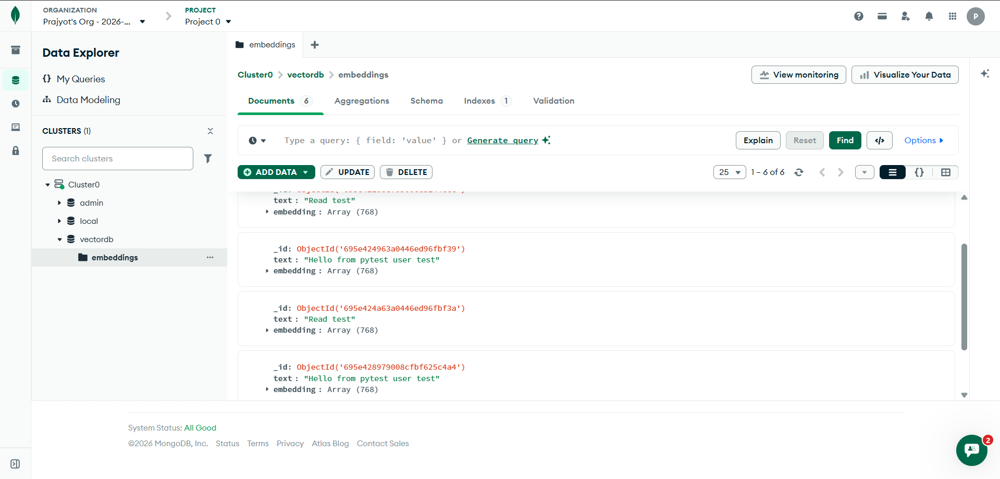

# Embeddings API (FastAPI + Ollama + MongoDB)
A simple API to generate text embeddings using Ollama and store them in MongoDB.

## Features

- Generate embeddings from input text
- Store embeddings in MongoDB
- Retrieve embeddings by document ID
- RESTful API with automatic documentation

---

## Tech Stack

- **Backend**: FastAPI
- **Database**: MongoDB
- **Embedding Model**: Ollama
- **Language**: Python
- **API Docs**: Swagger (OpenAPI)

---

## How to Run

- Start MongoDB (local or Atlas)
- Create a `.env` file and add:
  - `MONGO_URI`
  - `DATABASE_NAME`
  - `OLLAMA_MODEL`
- Install dependencies:
  ```bash
  pip install -r requirements.txt
  ```
- Run the server
   ```
   uvicorn app.main:app --reload
   ```

---

## API Testing
- Swagger UI: http://127.0.0.1:8000/docs
- Base URL: http://127.0.0.1:8000

---

### Database Screenshot
