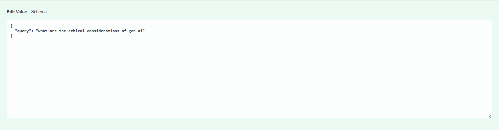
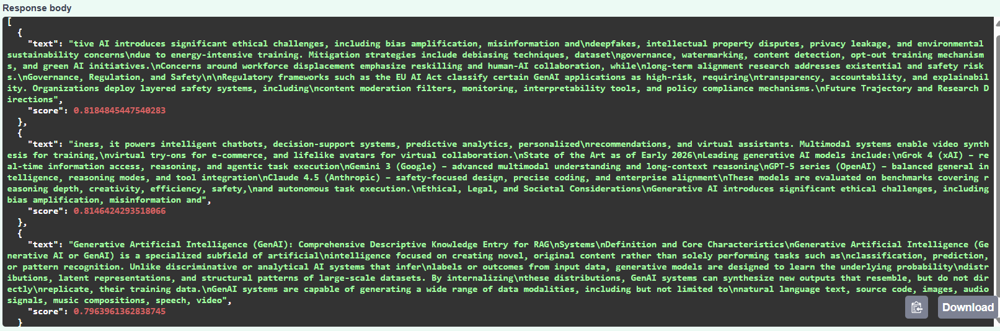

# Embeddings API (FastAPI + Ollama + MongoDB)

A simple FastAPI-based API to generate text embeddings using **Ollama**, store them in **MongoDB**, process **PDF files**, and perform **vector similarity search**.

---

## Features

- Generate embeddings from input text
- Store embeddings in MongoDB
- Retrieve embeddings by document ID
- Upload PDF files and extract text
- Chunk PDF text and generate embeddings per chunk
- Perform vector similarity search on stored chunks
- RESTful API with automatic documentation

---

## Tech Stack

- **Backend**: FastAPI
- **Database**: MongoDB (Vector Search)
- **Embedding Model**: Ollama
- **PDF Processing**: PyPDF2
- **Language**: Python
- **API Docs**: Swagger (OpenAPI)

---

## How to Run

- Start MongoDB (local or Atlas)
- Create a `.env` file and add:
  - `MONGO_URI`
  - `DATABASE_NAME`
  - `OLLAMA_MODEL`

- Install dependencies:
  ```bash
  pip install -r requirements.txt
- Run the server:
  ```bash
  uvicorn app.main:app --reload
---

## API Testing
- Swagger UI: http://127.0.0.1:8000/docs
- Base URL: http://127.0.0.1:8000
---
## Screenshots


